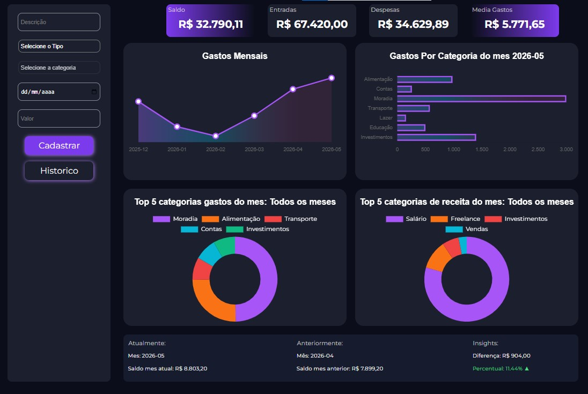

# 💰 Finance Tracker

Sistema de controle financeiro com dashboard interativo para gerenciamento de gastos, análise de despesas e visualização de dados.

---

## 🚀 Sobre o projeto

O **Finance Tracker** foi desenvolvido com o objetivo de ajudar usuários a organizarem suas finanças através de uma interface intuitiva, gráficos dinâmicos e visualização clara de entradas e saídas.

O sistema permite registrar movimentações financeiras, acompanhar categorias de gastos e visualizar estatísticas em tempo real.

Além do controle financeiro, o projeto também foi pensado como prática de desenvolvimento full stack, utilizando conceitos modernos de API, banco de dados e construção de dashboards.

---

## ✨ Funcionalidades

* 📌 Cadastro de receitas e despesas
* 📊 Dashboard com gráficos interativos
* 📅 Filtros por período
* 🧾 Organização por categorias
* 💸 Controle de gastos mensais
* 📈 Visualização de estatísticas financeiras
* 🔎 Interface intuitiva e responsiva
* ⚡ Atualização dinâmica de dados

---

## 🚀 Funcionalidades novas

### 📊 Geração de Relatórios Financeiros com IA

O sistema permite gerar relatórios financeiros personalizados a partir das transações cadastradas pelo usuário.

O usuário seleciona um mês específico e a aplicação:

1. Busca os dados financeiros daquele período;
2. Calcula informações como:
   - Receita total;
   - Despesas totais;
   - Saldo do período;
   - Distribuição de gastos por categoria;
   - Taxa de economia;
3. Envia os dados para uma IA gerar uma análise financeira;
4. Converte o relatório gerado em um arquivo PDF.

O relatório contém:

- Resumo financeiro do mês;
- Análise das receitas;
- Análise das despesas;
- Principais categorias de gastos;
- Recomendações financeiras personalizadas.

---

## 🛠️ Tecnologias utilizadas

### Front-end

* HTML5
* CSS3
* JavaScript
* Charts.js

### Back-end

* Node.js
* Express.js

### Banco de dados

* SQL

### Ferramentas

* Git
* GitHub
* MySQL
* VSCODE
* Power BI *(planejado para futuras integrações)*

---

## 📷 Preview do projeto

---




---


## ⚙️ Como executar o projeto

### 1️⃣ Clone o repositório

```bash
git clone https://github.com/oLuiz1n/finance-tracker.git
```

### 2️⃣ Entre na pasta do projeto

```bash
cd finance-tracker
```

### 3️⃣ Instale as dependências

```bash
npm install
```

### 4️⃣ Configure o banco de dados

* Crie o banco SQL
* Execute o arquivo `schema.sql`
* Configure as variáveis de ambiente

---

### 5️⃣ Inicie o servidor

```bash
npm start
```

---

## 🎯 Objetivos do projeto

* Praticar desenvolvimento full stack
* Melhorar conhecimentos em APIs
* Trabalhar com manipulação de dados financeiros
* Criar dashboards modernos e responsivos
* Evoluir habilidades em Engenharia de Software

---

## 📌 Melhorias futuras

* 🔐 Sistema de autenticação
* ☁️ Deploy em nuvem
* 📱 Versão mobile

---

## 👨‍💻 Autor

Desenvolvido por **Luiz Gustavo de Oliveira**.

* LinkedIn: [https://www.linkedin.com/](https://www.linkedin.com/in/luiz-gustavo-de-oliveira-54a3a72b2/)
* GitHub: [https://github.com/](https://github.com/oLuiz1n)

---